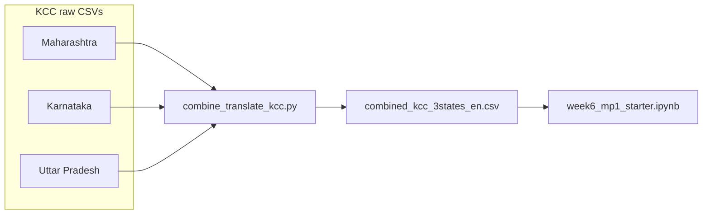

# Use combined KCC CSV in Week 6 MP1 notebook

## Context

- **Current behavior:** The notebook loads [`Week 5/A5/MP, UP and Raj.csv`](Week%205/A5/MP%2C%20UP%20and%20Raj.csv) via a small list of relative path candidates in the Section 2 load cell (around lines 267–285 in the `.ipynb` source).
- **Target artifact:** [combine_translate_kcc.py](Week%206/combine_translate_kcc.py) merges KCC CSVs under [`Week 6/KCC Data /`](Week%206/KCC%20Data%20/) (Maharashtra, Karnataka, Uttar Pradesh — note the **trailing space** on the `Uttar Pradesh ` folder name) and writes **`Week 6/KCC Data /combined_kcc_3states_en.csv`** with `encoding='utf-8-sig'` and an extra column **`KccAns_en`** plus **`_source_file`** (and raw files add `KCCCallID`, `day`, `month`, `year` compared to the old 11-column extract).

- **Compatibility:** Columns needed for the starter’s three questions are all present on the combined file: **`StateName`**, **`Crop`**, **`QueryType`**, **`BlockName`**, **`KccAns`** (and optionally **`KccAns_en`** for English text). **`QueryType`** values in the combined data still include leading/trailing tabs in many rows (same pattern as the old MP/UP/Raj file), so **`.astype(str).str.strip()`** (or a dedicated `QueryType_clean`) should be applied before exact matches like `"Plant Protection"`.

## Implementation steps

1. **Update the notebook header (Section 1 intro markdown)**  
   - Replace the dataset line so it describes **`combined_kcc_3states_en.csv`** (and optionally notes that it is produced by `combine_translate_kcc.py`).  
   - Adjust the **geographic scope** in prose where it still says MP / UP / Rajasthan: the combined pipeline is **Maharashtra, Karnataka, Uttar Pradesh** (not Rajasthan).

2. **Replace the Section 2 load cell**  
   - Set `filename = "combined_kcc_3states_en.csv"` (or equivalent).  
   - Extend **`candidates`** so the file resolves whether the kernel’s working directory is the repo root, `Week 6/`, or `Week 6/Week6_files/` (mirror the existing pattern used for the old CSV), including the real folder name **`KCC Data /`** with its trailing space.  
   - Use **`pd.read_csv(csv_path, encoding="utf-8-sig", low_memory=False)`** to match the script output.

3. **Add a small post-load normalization step (one short code cell or the tail of the load cell)**  
   - **`df['QueryType_clean'] = df['QueryType'].astype(str).str.strip()`** for all analyses that filter on query type.  
   - Optionally document in markdown that **`KccAns_en`** holds English translations for non-ASCII answers when the script has finished running.

4. **Keep Question 1 code structurally the same**  
   - Existing Q1 logic ([`StateName`, `Crop`] groupby) works unchanged; only **re-run** the notebook so saved outputs reflect MAHARASHTRA / KARNATAKA / UTTAR PRADESH (and any Karnataka-specific crop mix).

5. **Implement Section 3 for Questions 2 and 3** (cells are currently placeholders or mislabeled)  
   - **Q2 — “Which blocks have the most Plant Protection queries?”**  
     - Filter rows where **`QueryType_clean == "Plant Protection"`** (after confirming that stripped values match; if variants exist, fall back to `.str.contains("Plant Protection", case=False, na=False)` only if needed).  
     - Count by **`StateName` + `BlockName`** (and include **`DistrictName`** in the grouped key or in a display label if many block names repeat across districts/states).  
     - Present a table (e.g. top 15 overall or top N per state) and a simple bar chart if useful.  
   - **Q3 — “Which state has the highest percentage of unanswered queries?”**  
     - Define **unanswered** as missing or blank **`KccAns`** after string conversion and strip (consistent with the old dataset’s missing-answer pattern).  
     - Compute **`unanswered / total * 100`** per **`StateName`** and identify the maximum.

6. **Fix adjacent markdown that mislabels Question 2**  
   - The markdown after Q1 currently describes Q1 again under a “Question 2” heading; retitle/replace so each question’s interpretation block matches the analysis above it.

7. **Operational note (no code required in the script)**  
   - The notebook will consume the **CSV output**, not import the Python module. Remind yourself in the overview: if `combined_kcc_3states_en.csv` is missing or stale, run from `Week 6/`:  
     `python3 combine_translate_kcc.py` or `python3 combine_translate_kcc.py --resume`.

## What you will need to do after edits

- **Re-run all cells** so embedded outputs (shape, `df.head()`, charts) match the combined dataset.  
- **Refresh written interpretations** in Section 1 / Section 5 if they still refer to the old three states or file.

## Files touched

- Only [Week 6/Week6_files/week6_mp1_starter.ipynb](Week%206/Week6_files/week6_mp1_starter.ipynb) (unless you later add a separate `mp1.md` for the competency claim, which the starter already mentions).
